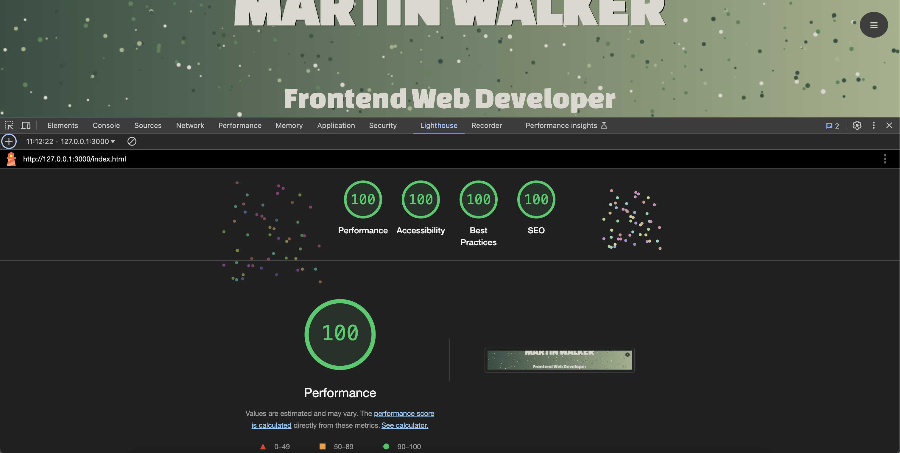

# My Portfolio

## Overview

This portfolio showcases my work as a front-end developer, demonstrating my skills in HTML, CSS, and JavaScript. It provides a platform for potential employers and collaborators to view my projects and understand my capabilities in creating interactive and responsive web applications.

## Features

- **Responsive Design**: The portfolio is designed to be mobile-friendly, ensuring a seamless user experience across devices.
- **Project Showcase**: The projects section is currently being used as a placeholder section as I begin to build my portfolio of projects.
- **Contact Information**: Visitors can easily get in touch with me through the contact section in the footer as well as the information on the canvas section.

## Value to Users

This portfolio serves as a visual representation of my skills and projects, enabling users to assess my work and reach out for potential collaborations or job opportunities. It highlights my commitment to building functional, user-friendly websites and applications.

## Code Attribution

If any code from other sources has been used in this project, it will be properly attributed in the relevant sections of the codebase.

- [Chris Courses](https://www.youtube.com/@ChrisCourses) - I followed some of Chris' courses to help me further my understanding of using canvases in HTML and JavaScript to add interactivity to my home page. I adapted his code to suit my visual needs.

## Testing Procedures and Findings

- **Functionality Testing**: I have tested all links and interactive elements to ensure they work as intended.
- **Responsiveness Testing**: The layout has been checked on various devices and screen sizes to confirm that it remains user-friendly.
- **Cross-Browser Testing**: The portfolio has been tested on popular browsers (Chrome, Firefox, Safari) to ensure consistent performance.

## Conclusion

Thank you for visiting my portfolio! I hope you find it informative and inspiring. Please feel free to reach out with any questions or feedback.

